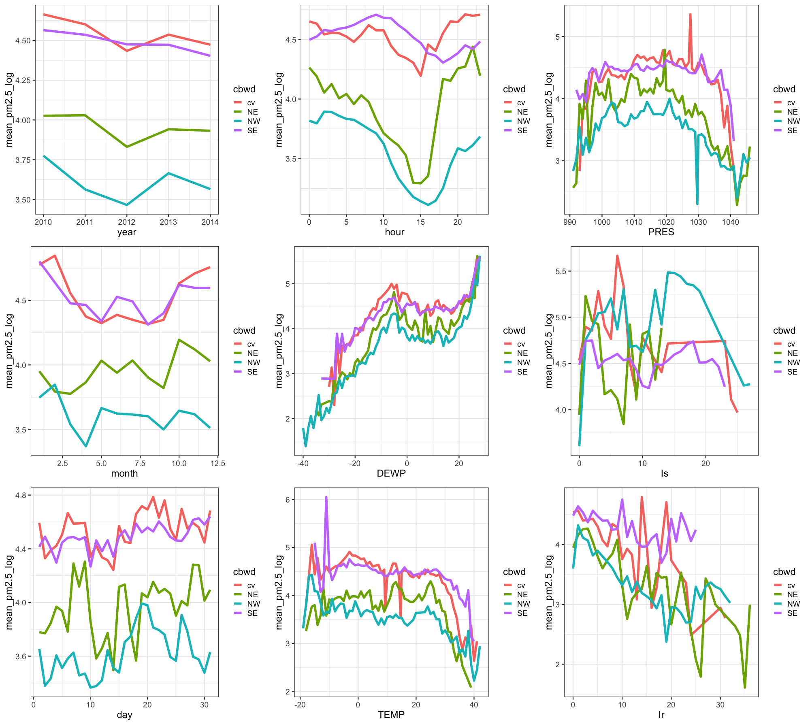
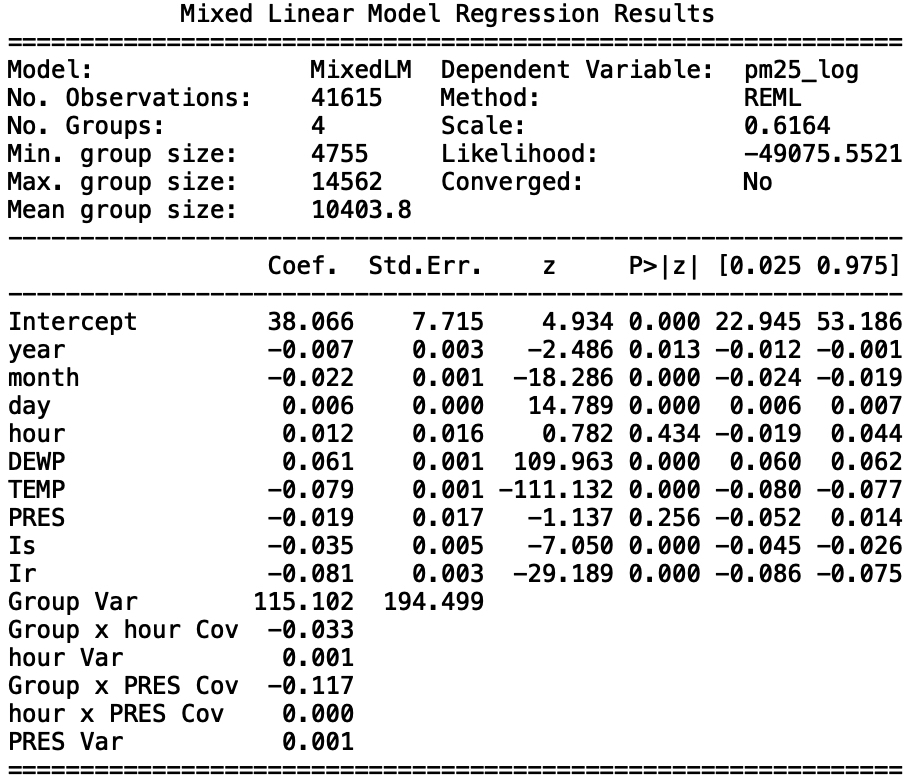

##Topic Introduction
Beijing's air pollution poses a big threat to the health of local residents. The PM 2.5 Index has been known as an important indication of the air quality.
We use the data from the link[**Beijing PM2.5 Data Data Set** from UCI Machine Learning Repository]
https://archive.ics.uci.edu/ml/machine-learning-databases/00381/PRSA_data_2010.1.1-2014.12.31.csv).
Exploring an effective way of predicting PM 2.5 Index will be an important step towards addressing the pollution. However, various factors such as dew point, temperature, pressure, etc.
may influence PM 2.5 and the relationships between them remain unclear. Thus, it is challenging to accurately predict PM 2.5. To address this problem, 
Linear Mixed Effects Model is adopted to predict the response variable (ie. air quality) based on the numerous explanatory variables (meteorological records).

```{r setup, include=FALSE}
library(knitr)
library(tidyverse)
library(lme4)
library(nlme)
library(lmerTest)
library(faraway)
library(stargazer)
```


```{r pm2.5, echo=FALSE, fig.align='center', out.width = '30%'}

```


##Model Introduction
Ecological and meteorological data are often complex and messy because of the inclusion of grouping factors like gender, population, continents, and seasons.
When fitting a complicated models with many parameters and observations, the data points might not be truly independent from each other. For example, 
all observations from a meterological dataset could be collected on the same site. Therefore, mixed models were developed to overcome such problem 
and let us to be able to use all of our data. Mixed models are applied in many disciplines where multiple correlated measurements are made on each unit of interest.
The core of mixed model is that it incorporates fixed and random effects. The difference between fixed and random effects is that a fixed effect is an effect 
that is constant for a given population, but a random effect is an effect that varies for a given population.

A typical linear regression model takes the form $$y = X\beta+\epsilon$$ where $X$ is the fixed effects with coefficients $\beta$. $\epsilon$ corresponds to random noise, $\epsilon \sim  \mathcal{N}(0,I)$.


In a linear mixed effects model, $Z\gamma$ are being added. $Z$ corresponds to random effects with coefficicients $\gamma$. Tne model has the form $$Y = X\beta +Z\gamma+\epsilon$$ and $\gamma \sim \mathcal{N}(0,\sigma^2I)$.


##Data Description
The PM 2.5 Index dataset includes 43824 observations and 12 attributes. Here is a table of the attributes' information.
```{r, echo=FALSE}
var_dis = read.csv("Variable_Description.csv")
colname = c("Variable",	"Description", "Data Type")
colnames(var_dis) = colname
knitr::kable(var_dis)
```


## Three Approaches {.tabset .tabset-fade}

### **lme4** in R
```{r source, include=FALSE}
source('./group_project.R')
```

We first preprocess the data before fitting a model. 
```{r load_data, warning=FALSE, echo=TRUE}
AQ=read.csv("Beijing.csv")
# divide the months into four seasons
seasons = c( 'winter',
             'winter',
             rep('spring',3),
             rep('summer',3),
             rep('fall',3),
             'winter'
)
# delete the mising values
AQ = AQ %>%
  filter(!is.na(pm2.5) & pm2.5 > 0) %>%
  mutate(season=factor(month, 1:12, seasons)) 
# boxplot for response grouped by cbwd
qplot(cbwd, pm2.5, facets = . ~ cbwd, 
      colour = cbwd, geom = "boxplot", data = AQ)
```

We can see that the data is seriously left-skewed, so we need to do some transfomation. We draw **Box-Cox** plot for the data.

```{r boxcox, warning=FALSE, echo=TRUE}
# draw the box-cox plot
g =lm(pm2.5~., data = AQ)
#boxcox(g,plotit=T)
# the plot a log transformation for the response 
AQ=
  AQ%>%
  mutate(pm2.5_log=log(pm2.5)) %>%
  filter(is.finite(pm2.5_log))
```

The **Box-Cox** plot suggests a log transformation for the response variable. We then drop the outliers and draw the boxplot for response grouped by the variable **cbwd**.

```{r boxplot, warning=FALSE, echo=TRUE}
qplot(cbwd, pm2.5_log, facets = . ~ cbwd, 
      colour = cbwd, geom = "boxplot", data = AQ_de)
```

We can see that the response shows difference in different groups. It is resasonable to establish the following model:


$$pm2.5=year+month+day+hour+pm2.5+DEWP+TEMP+PRES+Iws+Is+Ir+(1|cbwd)+\epsilon$$

In the models above, we assumed that the effect of predictors was the same for all wind directions. However, the effect of politeness might be different for different subjects. 
Therefore, what we need is a random slope model, where predictors in different wind directions are not only allowed to have differing intercepts, however, where they are also allowed to have different slopes. We draw the response **pm2.5** against the predictors in different wind directions.

```{r function, warning=FALSE, echo=TRUE}
# Multiple plot function----------------------------------------------------------------------------
#
# ggplot objects can be passed in ..., or to plotlist (as a list of ggplot objects)
# - cols:   Number of columns in layout
# - layout: A matrix specifying the layout. If present, 'cols' is ignored.
#
# If the layout is something like matrix(c(1,2,3,3), nrow=2, byrow=TRUE),
# then plot 1 will go in the upper left, 2 will go in the upper right, and
# 3 will go all the way across the bottom.
#
multiplot <- function(..., plotlist=NULL, file, cols=1, layout=NULL) {
  library(grid)
  
  # Make a list from the ... arguments and plotlist
  plots <- c(list(...), plotlist)
  
  numPlots = length(plots)
  
  # If layout is NULL, then use 'cols' to determine layout
  if (is.null(layout)) {
    # Make the panel
    # ncol: Number of columns of plots
    # nrow: Number of rows needed, calculated from # of cols
    layout <- matrix(seq(1, cols * ceiling(numPlots/cols)),
                     ncol = cols, nrow = ceiling(numPlots/cols))
  }
  
  if (numPlots==1) {
    print(plots[[1]])
    
  } else {
    # Set up the page
    grid.newpage()
    pushViewport(viewport(layout = grid.layout(nrow(layout), ncol(layout))))
    
    # Make each plot, in the correct location
    for (i in 1:numPlots) {
      # Get the i,j matrix positions of the regions that contain this subplot
      matchidx <- as.data.frame(which(layout == i, arr.ind = TRUE))
      
      print(plots[[i]], vp = viewport(layout.pos.row = matchidx$row,
                                      layout.pos.col = matchidx$col))
    }
  }
}
```

```{r plot, warning=FALSE, echo=TRUE, eval=FALSE}
# draw the plots of pm2.5_log_mean vs. predictors in cbwd groups----------------------------------
p1 = AQ_de %>%
  group_by(cbwd, year) %>%
  summarise(mean_pm2.5_log = mean(pm2.5_log)) %>%
  ggplot(aes(x=year, y=mean_pm2.5_log, 
                     colour=cbwd, group=cbwd)) +
  geom_line(size=2) 
p2 = AQ_de %>%
  group_by(cbwd, month) %>%
  summarise(mean_pm2.5_log = mean(pm2.5_log)) %>%
  ggplot(aes(x=month, y=mean_pm2.5_log, 
             colour=cbwd, group=cbwd)) +
  geom_line(size=2) 
p3 = AQ_de %>%
  group_by(cbwd, day) %>%
  summarise(mean_pm2.5_log = mean(pm2.5_log)) %>%
  ggplot(aes(x=day, y=mean_pm2.5_log, 
             colour=cbwd, group=cbwd)) +
  geom_line(size=2) 
p4 = AQ_de %>%
  group_by(cbwd, hour) %>%
  summarise(mean_pm2.5_log = mean(pm2.5_log)) %>%
  ggplot(aes(x=hour, y=mean_pm2.5_log, 
             colour=cbwd, group=cbwd)) +
  geom_line(size=2) 
p5 = AQ_de %>%
  group_by(cbwd, DEWP) %>%
  summarise(mean_pm2.5_log = mean(pm2.5_log)) %>%
  ggplot(aes(x=DEWP, y=mean_pm2.5_log, 
             colour=cbwd, group=cbwd)) +
  geom_line(size=2) 
p6 = AQ_de %>%
  group_by(cbwd, TEMP) %>%
  summarise(mean_pm2.5_log = mean(pm2.5_log)) %>%
  ggplot(aes(x=TEMP, y=mean_pm2.5_log, 
             colour=cbwd, group=cbwd)) +
  geom_line(size=2) 
p7 = AQ_de %>%
  group_by(cbwd, PRES) %>%
  summarise(mean_pm2.5_log = mean(pm2.5_log)) %>%
  ggplot(aes(x=PRES, y=mean_pm2.5_log, 
             colour=cbwd, group=cbwd)) +
  geom_line(size=2) 
p8 = AQ_de %>%
  group_by(cbwd, Is) %>%
  summarise(mean_pm2.5_log = mean(pm2.5_log)) %>%
  ggplot(aes(x=Is, y=mean_pm2.5_log, 
             colour=cbwd, group=cbwd)) +
  geom_line(size=2) 
p9 = AQ_de %>%
  group_by(cbwd, Ir) %>%
  summarise(mean_pm2.5_log = mean(pm2.5_log)) %>%
  ggplot(aes(x=Ir, y=mean_pm2.5_log, 
             colour=cbwd, group=cbwd)) +
  geom_line(size=2) 
# plot the figures----------------------------------------------------------------------------------- 
multiplot(p1, p2, p3, p4, p5, p6, p7, p8, p9,cols=3)
```

```{r jietu, echo=FALSE, fig.align='center'}

```

According to the plots, we decide to choose the following model:

$$pm2.5=year+month+day+hour+pm2.5+DEWP+TEMP+PRES+Iws+Is+Ir+(1+hour+PRES|cbwd)+\epsilon$$


```{r sum_lme4, warning=FALSE, echo=TRUE}
library(lme4)
res = lmer(pm2.5_log ~ year+month+day+hour+DEWP+TEMP+PRES+Is+Ir+(1+hour+PRES|cbwd), 
           REML = TRUE,
           data = AQ_de)
summary(res)
```
We can see hour and PRES are not significant predictors.
Then we test whether random effects are warranted:

```{r test}
resb = lm(pm2.5_log ~ year+month+day+hour+DEWP+TEMP+PRES+Is+Ir, data = AQ_de)
dev1 = -2*logLik(res);dev0 = -2*logLik(resb)
devdiff = as.numeric(dev0-dev1)
dfdiff <- attr(dev1,"df")-attr(dev0,"df"); dfdiff
cat('Chi-square =', devdiff, '(df=', dfdiff,'), p =', 
    pchisq(devdiff,dfdiff,lower.tail=FALSE))
```

and compare the BIC:
```{r bic}
BIC(resb, res) # compare the BIC of simple linear regression and linear mixed model
```

Apparently, the random effect is significant.


### **nlme** in R

We follow the steps to clean and process oringin data in the first part and get our dataset to fit regression. Then we use **nlme**, the default package for mixed model analysis in R, to fit the model.

```{r nlme}
library(nlme)
resc=lme(pm2.5_log ~ year+month+day+hour+DEWP+TEMP+PRES+Is+Ir, random=~1+hour+PRES|cbwd,  
            method = 'ML', data = AQ_de)
summary(resc)
```

```{r scatter}
# plot the residuals vs. fitted values plot
plot(resc)
```

```{r qqplot}
# plot qqplot
qqnorm(resid(resc))
qqline(resid(resc))
```

We can see that the model has good fit result according to the qqplot and residuals vs. fitted values plot.

```{r compare}
library(stargazer)
stargazer(resc, type = "text",
          digits = 3,
          star.cutoffs = c(0.05, 0.01, 0.001),
          digit.separator = "")
```

From the table we can see only year is not significant, which is not the same conclusion as we derive from the first part.

```{r BIC_compare}
BIC(res, resc)
```

The coefficients are close to those when using **lme4**, and regression using **lme4** has smaller BIC.

### Python
```{python, eval=FALSE}
import statsmodels.api as sm
import statsmodels.formula.api as smf
import pandas as pd
import numpy as np
AQ = pd.read_csv('Beijing.csv')
dic = {1: "Winter",
       2: "Winter",
       3: "Spring",
       4: "Spring",
       5: "Spring",
       6: "Summer",
       7: "Summer",
       8: "Summer",
       9: "Fall",
       10: "Fall",
       11: "Fall",
       12: "Winter"}
AQ['season'] = AQ['month'].map(dic)
AQ = AQ.dropna()
AQ = AQ[AQ['pm2.5'] > 0]
AQ['pm25_log'] = np.log(AQ['pm2.5'])
AQ_cv = AQ[AQ['cbwd'] == 'cv']
AQ_cv = AQ_cv[(AQ_cv['pm25_log'] > 2.2) & (AQ_cv['pm25_log'] < 6.8)]
AQ_NE = AQ[AQ['cbwd'] == 'NE']
AQ_NE = AQ_NE[(AQ_NE['pm25_log'] > 0.5)]
AQ_NW = AQ[AQ['cbwd'] == 'NW']
AQ_NW = AQ_NW[(AQ_NW['pm25_log'] > 0.5)]
AQ_SE = AQ[AQ['cbwd'] == 'SE']
AQ_SE.sort_values(['pm25_log'], ascending=[False])
AQ_SE = AQ_SE[(AQ_SE['pm25_log'] > 0.5) & (AQ_SE['pm25_log'] < 6.291569)]
AQ_new = pd.concat([AQ_cv, AQ_NE, AQ_NW, AQ_SE])
mixed = smf.mixedlm("pm25_log ~ year+month+day+hour+DEWP+TEMP+PRES+Is+Ir", AQ_new, groups = AQ_new["cbwd"], re_formula="~hour+PRES")
mixed_fit = mixed.fit()
print(mixed_fit.summary())
```

Here is the output of the Linear Mixed Effect Model in Python. The result is close to the results from the two packages used in R.

```{r python_out, echo=FALSE, fig.align='left', out.width = '50%'}

```

The coefficients are close to the results from using **lme4** and **nlme**. The result shows that only hour and PRES are not significant, which agrees with the result from using **lme4**.

---

## Discussion

In this study, we applied the linear mixed effects model to Beijing Air Polution Dataset(pm2.5). After removing some of the outliers, we choose the variable "cbwd", the abbreviation of "combined wind direction, as our grouping variable. as random effect to fit the non-linear dataset using mixed effects models.
This grouping variable is selected based on common sense and plots that help us finding random slopes. As can be seen from the above analyses,
we conducted three models in R and Python. The results from the models are really significant suggesting that there are random effects in the dataset.
When comparing the BICs with the simple linear regression, the result shows that the linear mixed effects model fits better. 
Moreover, we concluded some additional suggestions from this model for the development in future research using this method.
First, this method may not always work well if we don't have the thorough knowledge of a dataset. For example,this model fits worse without cleaning the dataset and removing the outliers. 
Second, when there are many variables, it will be more difficult to find which ones to put in the random slope part(in the model function, this part starting with (1|a+b+...+z).
Therefore, we should pay more attention to model selection when applying Linear Mixed Effects Model. 
In addition, in R, when we use different packages, we should consider which model to use to fit the dataaset. 
In lmer function(from lme4 library), we used the suggested model, but similarly, in lme function(from nlme library), we got the approximately same result.

## Data source
[**Beijing PM2.5 Data Data Set** from UCI Machine Learning Repository](https://archive.ics.uci.edu/ml/machine-learning-databases/00381/PRSA_data_2010.1.1-2014.12.31.csv)

## References
1.[UCLA: Introduction to Linear Mixed Models - IDRE Stats](https://stats.idre.ucla.edu/other/mult-pkg/introduction-to-linear-mixed-models/)

2.[Standford University: Section Week 8 - Linear Mixed Models](https://web.stanford.edu/class/psych252/section/Mixed_models_tutorial.html)

3.[ETH Zürich: Linear Mixed-Effects Models](https://stat.ethz.ch/R-manual/R-devel/library/nlme/html/lme.html)

4.[Gabriela K Hajduk: Introduction to linear mixed models](https://ourcodingclub.github.io/2017/03/15/mixed-models.html?fbclid=IwAR0txmdRYH7OK6nfg1DRnHD9WDEcgcbBkGtGZlw2cTEC_yjnRMb0FsiL22U#FERE)

5.[Wikipedia: Mixed Model](https://en.wikipedia.org/wiki/Mixed_model)

6.Jianhua Wang et al, 'Effects of Meteorological Conditions on PM2.5 Concentrations in
Nagasaki, Japan', J.Environ, Res. Public Health 2015,12, p.9
