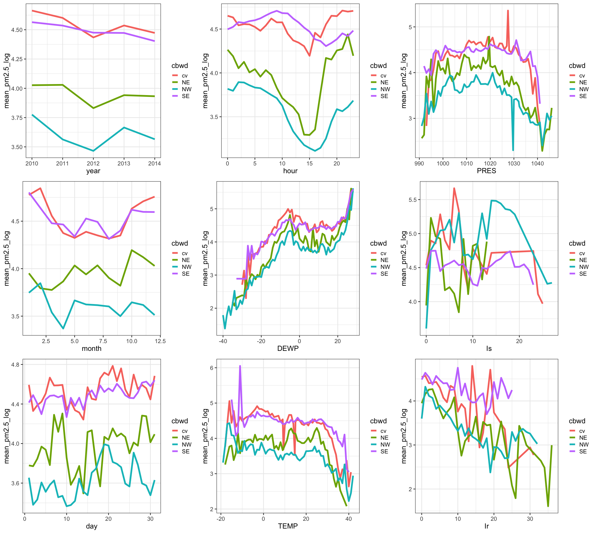

```{r setup, include=FALSE}
knitr::opts_chunk$set(echo = TRUE)
```


```{r source, include=FALSE}
source('./group_project.R')
```

## Running Linear Mixed Model using package **lme4** in R
We first preprocess the data before fitting a model. 

```{r load_data, warning=FALSE, echo=TRUE}
AQ=read.csv("./PRSA_data_2010.1.1-2014.12.31.csv")

# divide the months into four seasons
seasons = c( 'winter',
             'winter',
             rep('spring',3),
             rep('summer',3),
             rep('fall',3),
             'winter'
)

# delete the mising values
AQ = AQ %>%
  filter(!is.na(pm2.5) & pm2.5 > 0) %>%
  mutate(season=factor(month, 1:12, seasons)) 

# boxplot for response grouped by cbwd
qplot(cbwd, pm2.5, facets = . ~ cbwd, 
      colour = cbwd, geom = "boxplot", data = AQ)
```

We can see that the data is seriously left-skewed, so we need to do some transfomation. We draw **Box-Cox** plot for the data.

```{r boxcox, warning=FALSE, echo=TRUE}
# draw the box-cox plot
g =lm(pm2.5~., data = AQ)
boxcox(g,plotit=T)

# the plot a log transformation for the response 
AQ=
  AQ%>%
  mutate(pm2.5_log=log(pm2.5)) %>%
  filter(is.finite(pm2.5_log))
```

The **Box-Cox** plot suggests a log transformation for the response variable. We then drop the outliers and draw the boxplot for response grouped by the variable **cdwd**.

```{r boxplot, warning=FALSE, echo=TRUE}
qplot(cbwd, pm2.5_log, facets = . ~ cbwd, 
      colour = cbwd, geom = "boxplot", data = AQ_de)
```

We can see that the response shows difference in different groups. It is resasonable to establish the following model:


<center>**pm2.5=year+month+day+hour+pm2.5+DEWP+TEMP+PRES+Iws+Is+Ir+(1|cbwd)+$\epsilon$**</center>


In the models above, we assumed that the effect of predictors was the same for all wind directions. However, the effect of politeness might be different for different subjects. So, what we need is a random slope model, where predictors in different wind directions are not only allowed to have differing intercepts, but where they are also allowed to have different slopes. We draw the response **pm2.5** against the predictors in different wind directions.

```{r function, warning=FALSE, echo=TRUE}
# Multiple plot function----------------------------------------------------------------------------
#
# ggplot objects can be passed in ..., or to plotlist (as a list of ggplot objects)
# - cols:   Number of columns in layout
# - layout: A matrix specifying the layout. If present, 'cols' is ignored.
#
# If the layout is something like matrix(c(1,2,3,3), nrow=2, byrow=TRUE),
# then plot 1 will go in the upper left, 2 will go in the upper right, and
# 3 will go all the way across the bottom.
#
multiplot <- function(..., plotlist=NULL, file, cols=1, layout=NULL) {
  library(grid)
  
  # Make a list from the ... arguments and plotlist
  plots <- c(list(...), plotlist)
  
  numPlots = length(plots)
  
  # If layout is NULL, then use 'cols' to determine layout
  if (is.null(layout)) {
    # Make the panel
    # ncol: Number of columns of plots
    # nrow: Number of rows needed, calculated from # of cols
    layout <- matrix(seq(1, cols * ceiling(numPlots/cols)),
                     ncol = cols, nrow = ceiling(numPlots/cols))
  }
  
  if (numPlots==1) {
    print(plots[[1]])
    
  } else {
    # Set up the page
    grid.newpage()
    pushViewport(viewport(layout = grid.layout(nrow(layout), ncol(layout))))
    
    # Make each plot, in the correct location
    for (i in 1:numPlots) {
      # Get the i,j matrix positions of the regions that contain this subplot
      matchidx <- as.data.frame(which(layout == i, arr.ind = TRUE))
      
      print(plots[[i]], vp = viewport(layout.pos.row = matchidx$row,
                                      layout.pos.col = matchidx$col))
    }
  }
}

```

```{r plot, warning=FALSE, echo=TRUE, eval=FALSE}
# draw the plots of pm2.5_log_mean vs. predictors in cbwd groups----------------------------------
p1 = AQ_de %>%
  group_by(cbwd, year) %>%
  summarise(mean_pm2.5_log = mean(pm2.5_log)) %>%
  ggplot(aes(x=year, y=mean_pm2.5_log, 
                     colour=cbwd, group=cbwd)) +
  geom_line(size=2) 

p2 = AQ_de %>%
  group_by(cbwd, month) %>%
  summarise(mean_pm2.5_log = mean(pm2.5_log)) %>%
  ggplot(aes(x=month, y=mean_pm2.5_log, 
             colour=cbwd, group=cbwd)) +
  geom_line(size=2) 

p3 = AQ_de %>%
  group_by(cbwd, day) %>%
  summarise(mean_pm2.5_log = mean(pm2.5_log)) %>%
  ggplot(aes(x=day, y=mean_pm2.5_log, 
             colour=cbwd, group=cbwd)) +
  geom_line(size=2) 

p4 = AQ_de %>%
  group_by(cbwd, hour) %>%
  summarise(mean_pm2.5_log = mean(pm2.5_log)) %>%
  ggplot(aes(x=hour, y=mean_pm2.5_log, 
             colour=cbwd, group=cbwd)) +
  geom_line(size=2) 

p5 = AQ_de %>%
  group_by(cbwd, DEWP) %>%
  summarise(mean_pm2.5_log = mean(pm2.5_log)) %>%
  ggplot(aes(x=DEWP, y=mean_pm2.5_log, 
             colour=cbwd, group=cbwd)) +
  geom_line(size=2) 

p6 = AQ_de %>%
  group_by(cbwd, TEMP) %>%
  summarise(mean_pm2.5_log = mean(pm2.5_log)) %>%
  ggplot(aes(x=TEMP, y=mean_pm2.5_log, 
             colour=cbwd, group=cbwd)) +
  geom_line(size=2) 

p7 = AQ_de %>%
  group_by(cbwd, PRES) %>%
  summarise(mean_pm2.5_log = mean(pm2.5_log)) %>%
  ggplot(aes(x=PRES, y=mean_pm2.5_log, 
             colour=cbwd, group=cbwd)) +
  geom_line(size=2) 

p8 = AQ_de %>%
  group_by(cbwd, Is) %>%
  summarise(mean_pm2.5_log = mean(pm2.5_log)) %>%
  ggplot(aes(x=Is, y=mean_pm2.5_log, 
             colour=cbwd, group=cbwd)) +
  geom_line(size=2) 

p9 = AQ_de %>%
  group_by(cbwd, Ir) %>%
  summarise(mean_pm2.5_log = mean(pm2.5_log)) %>%
  ggplot(aes(x=Ir, y=mean_pm2.5_log, 
             colour=cbwd, group=cbwd)) +
  geom_line(size=2) 

# plot the figures----------------------------------------------------------------------------------- 
multiplot(p1, p2, p3, p4, p5, p6, p7, p8, p9,cols=3)
```

```{r jietu, echo=FALSE, fig.align='center'}

```

According to the plots, we decide to choose the following model:

<center>**pm2.5=year+month+day+hour+pm2.5+DEWP+TEMP+PRES+Iws+Is+Ir+(1+hour+PRES|cbwd)+$\epsilon$**</center>


```{r sum_lme4, warning=FALSE, echo=TRUE}
library(lme4)

res = lmer(pm2.5_log ~ year+month+day+hour+DEWP+TEMP+PRES+Is+Ir+(1+hour+PRES|cbwd), 
           REML = TRUE,
           data = AQ_de)
summary(res)
```
We can see hour and PRES are not significant predictors.
Then we test whether random effects are warranted:

```{r test}
resb = lm(pm2.5_log ~ year+month+day+hour+DEWP+TEMP+PRES+Is+Ir, data = AQ_de)

dev1 = -2*logLik(res);dev0 = -2*logLik(resb)
devdiff = as.numeric(dev0-dev1)
dfdiff <- attr(dev1,"df")-attr(dev0,"df"); dfdiff
cat('Chi-square =', devdiff, '(df=', dfdiff,'), p =', 
    pchisq(devdiff,dfdiff,lower.tail=FALSE))
```

and compare the BIC:
```{r bic}
BIC(resb, res) # compare the BIC of simple linear regression and linear mixed model
```

Apparently, the random effect is significant.


## Running Linear Mixed Model using package **nlme** in R

We follow the steps to clean and process oringin data in the first part and get our dataset to fit regression. Then we use **nlme**, the default package for mixed model analysis in R, to fit the model.

```{r nlme}
library(nlme)

resc=lme(pm2.5_log ~ year+month+day+hour+DEWP+TEMP+PRES+Is+Ir, random=~1+hour+PRES|cbwd,  
            method = 'ML', data = AQ_de)

summary(resc)
```

```{r scatter}
# plot the residuals vs. fitted values plot
plot(resc)
```

```{r qqplot}
# plot qqplot
qqnorm(resid(resc))
qqline(resid(resc))
```

We can see that the model has good fit result according to the qqplot and residuals vs. fitted values plot.

```{r compare}
library(stargazer)

stargazer(resc, type = "text",
          digits = 3,
          star.cutoffs = c(0.05, 0.01, 0.001),
          digit.separator = "")
```

From the table we can see only year is not significant, which is not the same conclusion as we derive from the first part.

```{r BIC_compare}
BIC(res, resc)
```

The result is close and regression using **lme4** has rather smaller BIC.